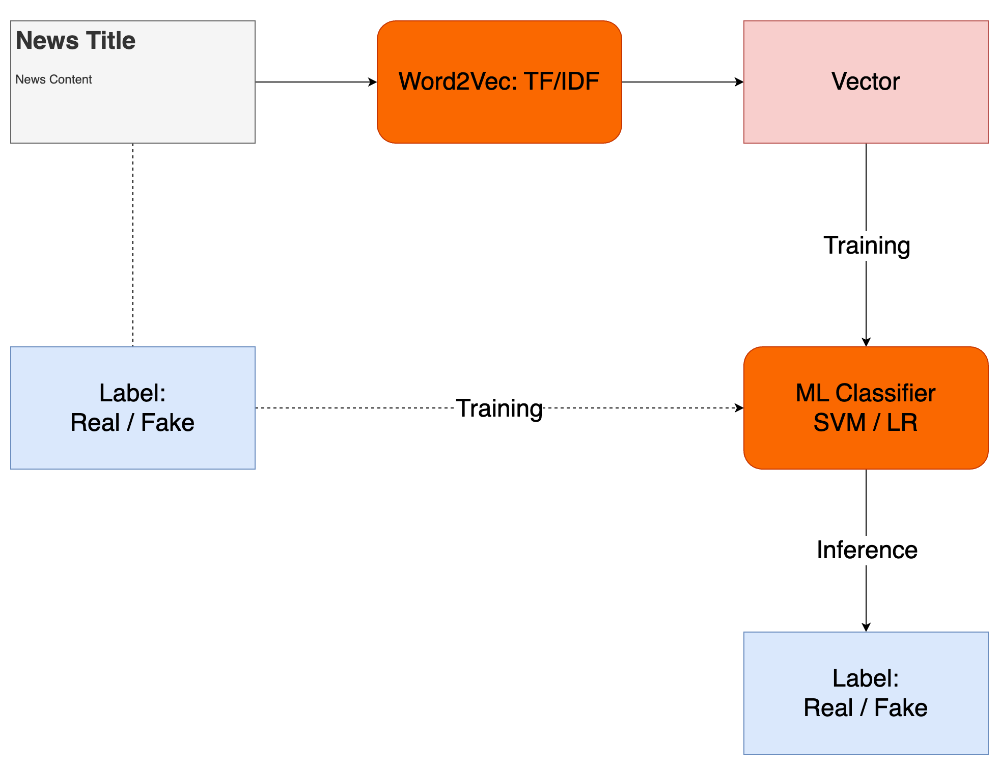
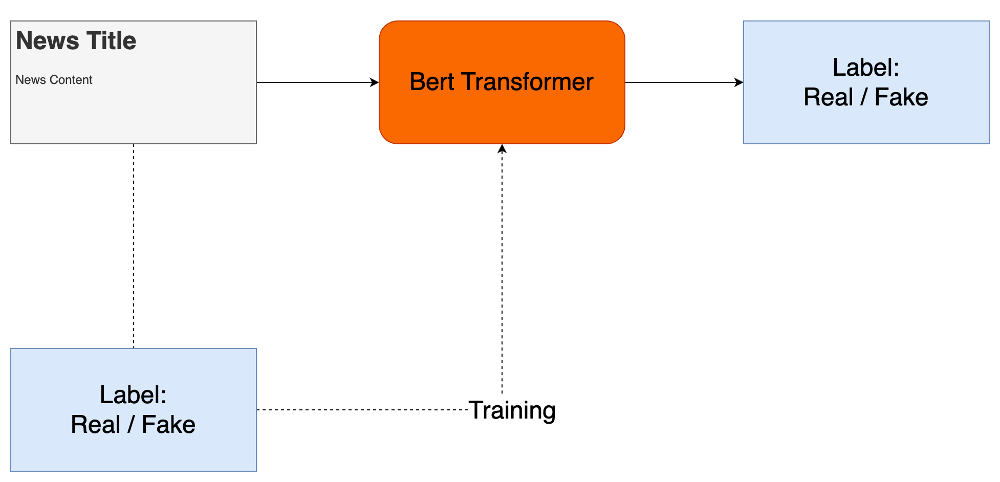
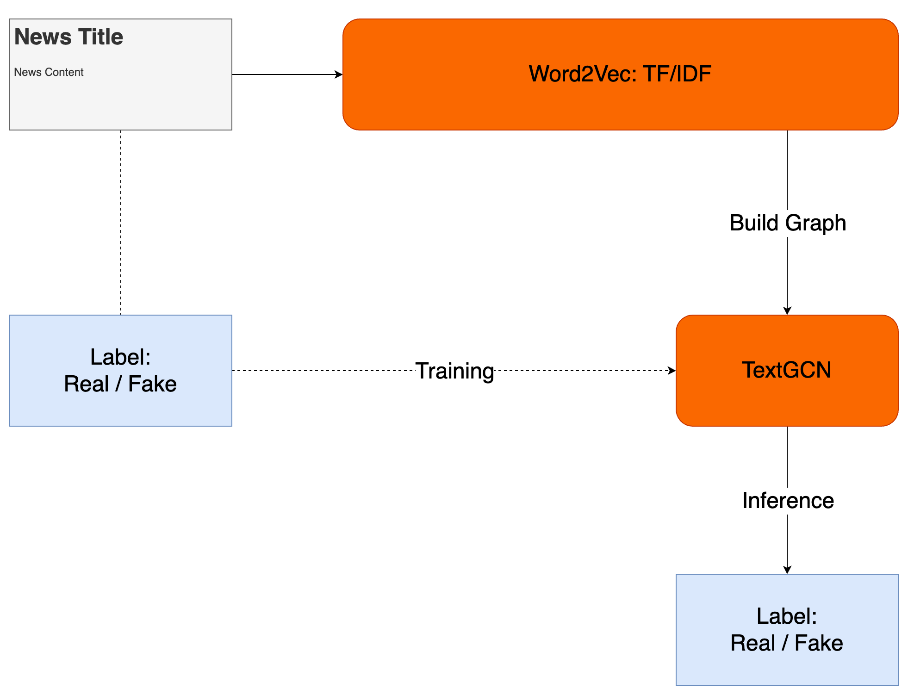
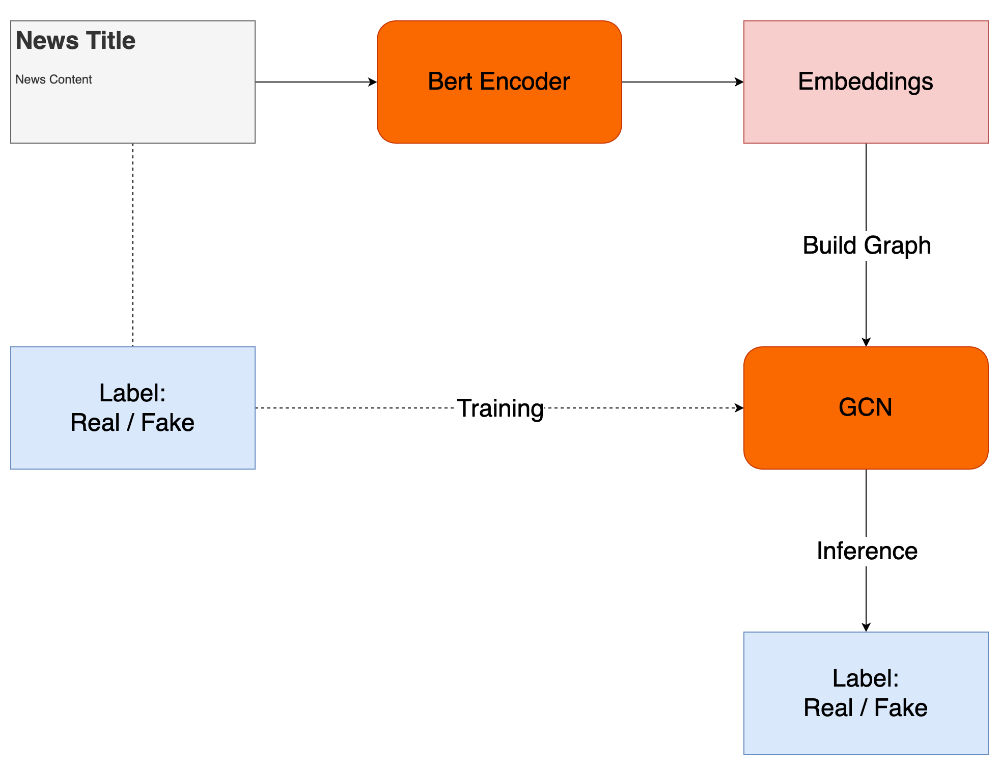

# Model Comparison for Fake News Detection 

## Setup
We recommend using conda to create a virtual environment and install the required packages.
```bash
conda create -n fake-news python=3.10
```
```bash
conda activate fake-news
```
```bash
pip install -r requirements.txt
```

## Dataset
[Fake News Detection Challenge KDD 2020](https://www.kaggle.com/competitions/fakenewskdd2020)

### Format
#### train.csv: A full training dataset with the following attributes:

- text: text of the article

- label: a label that marks the article as potentially unreliable
    - 1: fake
    - 0: true

#### test.csv: A test dataset with the following attributes:

- id: the id of the article text
- text: text of the article

#### sample_submission.csv: A sample submission with the following attributes.

- id: the id of the article text from the test data

- label: a label that marks the article as potentially unreliable
    - 1: fake
    - 0: true

## Evaluation
The evaluation metric for this competition is accuracy given by:

$$
\text{accuracy} = \frac{\text{correct predictions}}{\text{correct predictions} + \text{incorrect predictions}}
$$

## Model Pipeline

### 1. TF-IDF + ML Models

### 2. Word Embeddings + ML Models

### 3. Word Embeddings + Transformer Models

### 4. TF-IDF + TextGCN

### 4. Word Embeddings + GCN


## Results

We evaluate the performance by predicting the validation set.

We use `distilBERT` encoder to get the word embeddings.

- LR: Logistic Regression
- SVM: Support Vector Machine

| Model | ValidaAccuracy |
| --- | --- |
| TF-IDF + LR | 0.71 |
| TF-IDF + SVM | 0.72 |
| Word Embeddings + LR | 0.69 |
| Word Embeddings + SVM | 0.73 |
| Word Embeddings + BERT | 0.81 |
| TF-IDF + TextGCN | 0.66 |
| Word Embeddings + GCN (cos_sim) | 0.59 |
| Word Embeddings + GCN (KNN) | 0.61 |
