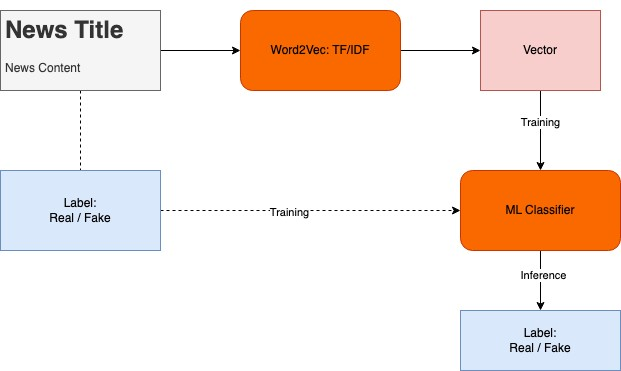
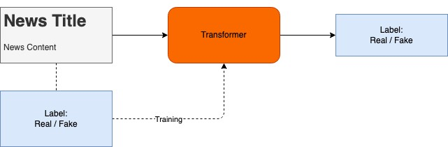
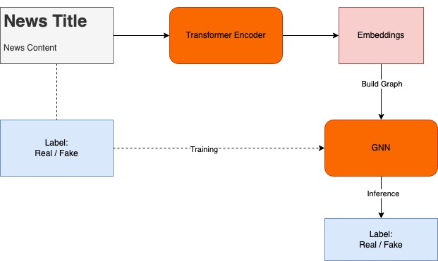

# Model Comparison for Fake News Detection 

## Setup
We recommend using a virtual environment to run this project. You can create a virtual environment using either conda or pip. 
- conda:
```bash
conda env create -f environment.yml
```
```bash
conda activate fake-news
```
- pip:
```bash
pip install -r requirements.txt
```

## Dataset
[Fake News Detection Challenge KDD 2020](https://www.kaggle.com/competitions/fakenewskdd2020)

### Format
#### train.csv: A full training dataset with the following attributes:

- text: text of the article

- label: a label that marks the article as potentially unreliable
    - 1: fake
    - 0: true

#### test.csv: A test dataset with the following attributes:

- id: the id of the article text
- text: text of the article

#### sample_submission.csv: A sample submission with the following attributes.

- id: the id of the article text from the test data

- label: a label that marks the article as potentially unreliable
    - 1: fake
    - 0: true

## Evaluation
The evaluation metric for this competition is accuracy given by:

$$
\text{accuracy} = \frac{\text{correct predictions}}{\text{correct predictions} + \text{incorrect predictions}}
$$

## Models Pipeline

### 1. TF-IDF + ML Models

### 2. Word Embeddings + ML Models

### 3. Word Embeddings + Transformer Models

### 4. Word Embeddings + GNN
